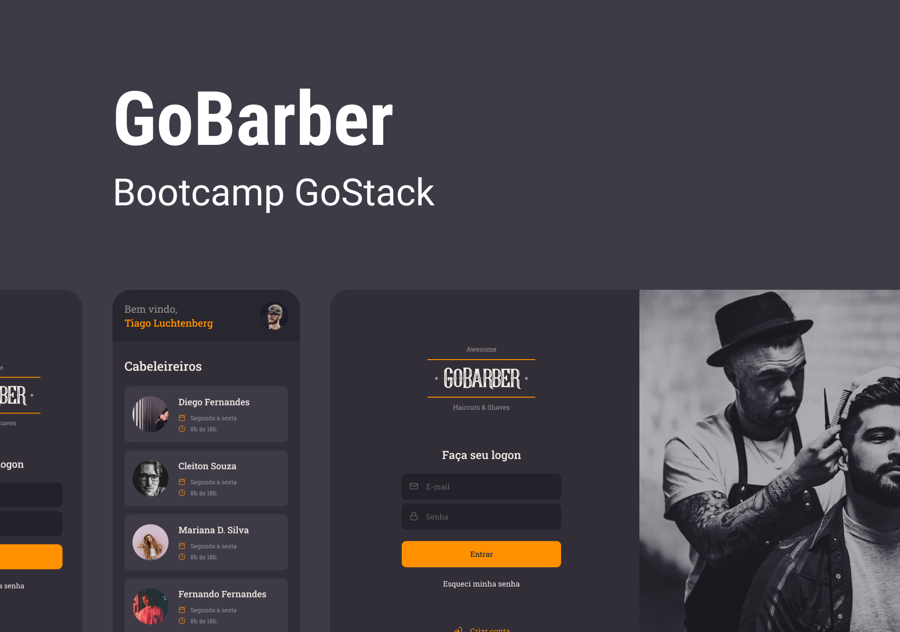

# GoBarber Server

<!-- PROJECT LOGO -->
 

  

#### Veja também as outras partes do projeto:
> web: https://github.com/bernardohmr/gobarber_web
> server: https://github.com/bernardohmr/gobarber_server

## O Projeto
O aplicativo GoBarber foi feito para que cabeleireiros ofertem sua agenda de atendimento e clientes possam reservar um horário específico.
Nós o desenvolvemos durante o Bootcamp GoStack da Rocketseat, e foi a principal aplicação dentre outras que fizemos.
Apesar de estar na versão 1.0, já foi possível aplicar vários conceitos avançados de projeto e o resultado ficou profissional!

## Dentre os principais conceitos destaco:
- Arquitetura de Software e Clean Code;
- Separation of Concerns;
- Adoção dos Princípios SOLID;
- Test Driven Development;
- Múltiplos bancos de dados;
- Cache;
- Componentização e reuso de código;
- Testes unitários e Testes End-to-end;
- Continuous Integration e CD/CD;

## E as principais tecnologias utilizadas foram:
- NodeJS
- ReactJS
- React Native
- Typescript
- TypeORM
- PostgreSQL
- MongoDB
- Redis
- Docker
